# SM445_PYTHANOS
Welcome to the master branch of team PYTHANOS! 

# Introduction
1. **Problem Statement No. - SM445**

2. **Team Name - PYTHANOS**

3. **Participant details:**

| Name                   | Institute                                | Mobile No. | Email ID                     |
| ---------------------- | ---------------------------------------- | ---------- | ---------------------------- |
| Prathamesh Nerkar      | FR. C. RODRIGUES INSTITUTE OF TECHNOLOGY | 8108800918 | prathameshn99@gmail.com      |
| Abhijit Acharya        | FR. C. RODRIGUES INSTITUTE OF TECHNOLOGY | 9867256109 | abhijit_acharya@outlook.com  |
| Suraj Mahangade        | FR. C. RODRIGUES INSTITUTE OF TECHNOLOGY | 9820871262 | surajmahangade9999@yahoo.com |
| Aishwarya Anna Mathew, | FR. C. RODRIGUES INSTITUTE OF TECHNOLOGY | 8108131266 | hello.ash99@gmail.com        |
| Ritoo Verma            | FR. C. RODRIGUES INSTITUTE OF TECHNOLOGY | 7021835514 | ritoov2@gmail.com            |
| Varad More             | FR. C. RODRIGUES INSTITUTE OF TECHNOLOGY | 9967438112 | varadmore1@gmail.com         |

4. **Mentor details:**

| Name               | Mobile No. | Email ID                      |
| ------------------ | ---------- | ----------------------------- |
| Saurav Panda       | 9167388937 | sauravgopinathpanda@gmail.com |
| Tanvi Rajadhyaksha | 9769919313 | rajadhyakshatanvi@gmail.com   |

5. **Problem Description**

Back Ground: A corporate action is an event initiated by a public company that will bring an actual
change to the securities—equity or debt—issued by the company. Corporate actions are typically agreed
upon by a company&#39;s board of directors and authorized by the shareholders. Examples of corporate
actions include stock splits, dividends, mergers and acquisitions, rights issues, and spin-offs. Corporate
action instantly impacts security valuation and hence its timely and accurate information is very critical
to financial institutes and investors. Information on current, upcoming, and historical corporate action
can be purchased from various data vendors like Bloomberg, ICE Data Service, Refinitiv, MarketMap, etc.
which could be expensive. Alternatively, data could be freely retrieved from public webpages and
company portal. Challenge with free data approach is its accuracy, reliability and completeness Problem
Statement: Goal of corporate action (CA) robot is to retrieve accurate, and complete information on
historical, current, and future expected corporate action in timely manner from free sources. Required
features:

1. Capability of crawling public web pages to retrieve information related to historical, current, and
future expected corporate action. Data could potentially be available directly on webpage or in form of
downloadable file (.pdf, .docx)
2. Ability of process information available in free text format like pdf, and MS word document
3. Intelligently identify context in which data is available, like is it listed as example, or is it a real
announced corporate action. We should also be able to classify CA as approved or yet to be approved
corporate action.
4. Extract important information from retrieved pages/files on corporate action like – Security Identifier
type (ISIN, CUSIP, Ticker, etc.), Identifier Value, corporate action type, Ex. Date, record date, pay date,
payment / ratio / other key information, other relevant corporate action details etc. Example: ISIN:
INE239A01016 Company: Nestle India Type of CA: Interim dividend Amount: Rs. 55 Ex Date: 11/12/2019
Rec Date: 12/12/2019 Pay Date: 02/01/2020
5. Build accurate, and complete data from conflicting data retrieved from multiple sources. It should
continuously learn about sources which could be trusted for specific information
6. Ability to configure to look for CA on a set of securities, to all listed securities on specific exchange.
7. Robot could be configured to continuously look for new data available for relevant corporate action.


# Resources


6. **Technology stack**

   | Tool                              | URL(References)                                              | Purpose for usage                                            |
   | --------------------------------- | ------------------------------------------------------------ | ------------------------------------------------------------ |
   | Amazon Web Services               | - EC2 https://aws.amazon.com/ec2/ <br />- RDShttps://aws.amazon.com/rds/ | - EC2<br />Servers for django backend and scraper- RDS Relational Database |
   | MySQL                             | https://dev.mysql.com/doc/                                   | to create tables                                             |
   | Django                            | https://docs.djangoproject.com/en/3.0/                       | Python Framework for website                                 |
   | Scikit Learn                      | https://scikit-learn.org/stable/user_guide.html              | Initially used for fuzzy Logic                               |
   | Tensorflow                        | https://www.tensorflow.org/                                  | Machine Learning                                             |
   | Webanno                           | https://github.com/webanno/webanno/                          | Annotation of data for training the model                    |
   | Apache                            | https://httpd.apache.org/docs/                               | Hosting Website                                              |
   | RESTful API Django REST Framework |                                                              | Framework Connecting microservices and provides API to the FIS Global server |
   | Universal Google Encoder          | https://ai.googleblog.com/2019/07/multilingual-universal-sentence-encoder.html | The Universal Sentence **Encoder** encodes text into high-dimensional vectors that can be used for text classification, semantic similarity, clustering and other natural language tasks. |
   | Spacy                             | https://spacy.io/api/doc                                     | Used for Name Entity Recognition                             |
   | Scrapy                            | https://docs.scrapy.org/en/latest/                           | scraper module for crawler 2                                 |
   | Pandas                            | https://pandas.pydata.org/pandas-docs/stable/                | Data Processing                                              |
   | Keras                             | https://keras.io/api/                                        | neural network library                                       |
   | Reportlab                         | https://www.reportlab.com/dev/docs/                          | to generate automated PDFs from texts                        |
   | Pytesseract                       | https://readthedocs.org/projects/pytesseract/                | For ocr of image pdfs                                        |
   | Beautifulsoup                     | https://www.crummy.com/software/BeautifulSoup/               | html parser                                                  |
   | CSS                               | https://developer.mozilla.org/en-US/docs/Web/CSS             | to beautify the Website                                      |
   | HTML5                             | https://developer.mozilla.org/en-US/docs/Web/Guide/HTML/HTML5 | To make templates for the website                            |
   | Javascript                        | https://developer.mozilla.org/en-US/docs/Web/javascript      | To make the webpages dynamic and incorporates responsiveness |
   | Bootstrap4                        | https://getbootstrap.com/docs/4.0/getting-started/introduction | CSS framework                                                |
   | NLTK                              | https://www.nltk.org/                                        | The Natural Language Toolkit (**NLTK**) is a platform **used** for building Python programs that work with human language data for applying in statistical natural language processing (NLP) |
   | Tika                              | https://pypi.org/project/tika-app/                           | A **Python** port of the Apache                              |
   | Re                                |                                                              | For string Matching                                          |
   | Docx                              |                                                              | to read MS Word                                              |

   

7. **Project hosting details:**

   Hosted on EC2 instance t2.medium 4GB RAM, 2 Virtual CPUs

   Find the website [here](http://3.237.8.100/)

8. **Source code URL**

   Our git repository is [here](https://github.com/prathameshn99/SM445_PYTHANOS)

9. **Project building instruction**

   Find the commands here

10. **Installation instruction**

    - Installation requirements: Run [this](https://github.com/prathameshn99/SM445_PYTHANOS/blob/master/Working_directory/install_requirements.py) script to install all requirements necessary to run the system

11. **Input samples supported by system**

    - registration page
    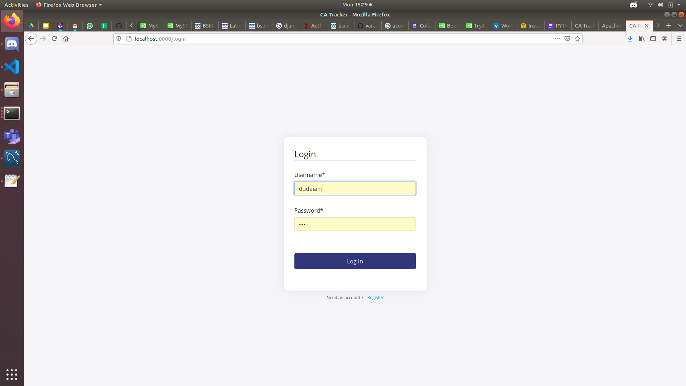

# Design

13. **Architecture Diagram:**

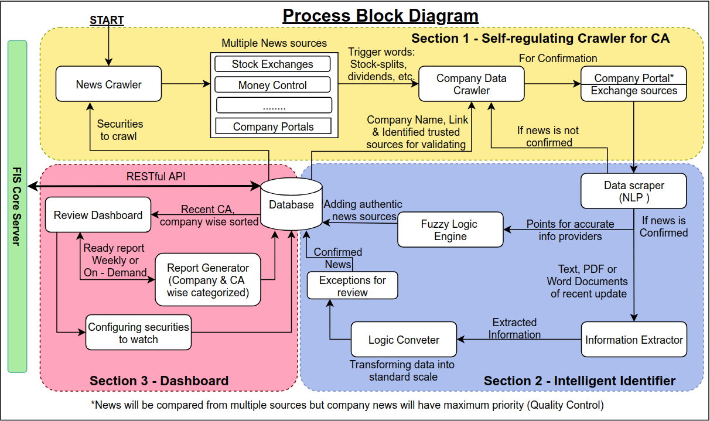

14. **Different data flows / pipelines:**

    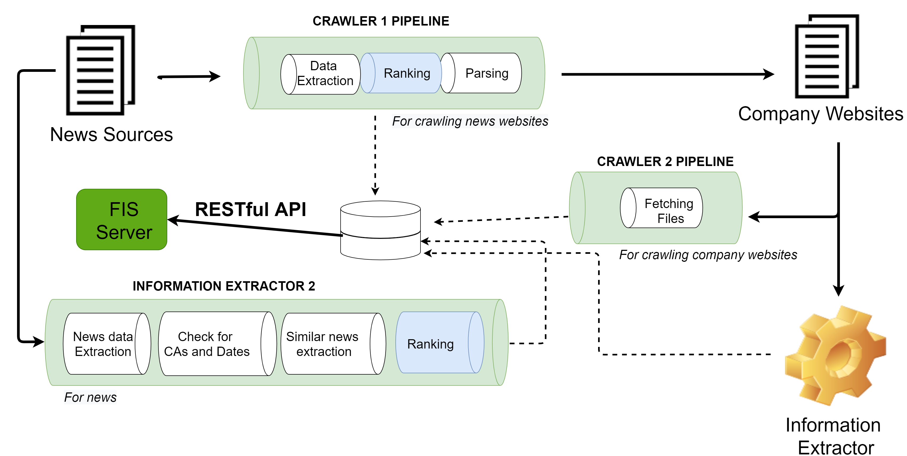

15. **AI /ML models used:**

    - Google Encoder
    -  NLTK (Name Entity Recognition using Spacy: en-web-lg)

16. **Data Scheme:**

    - Articles Table: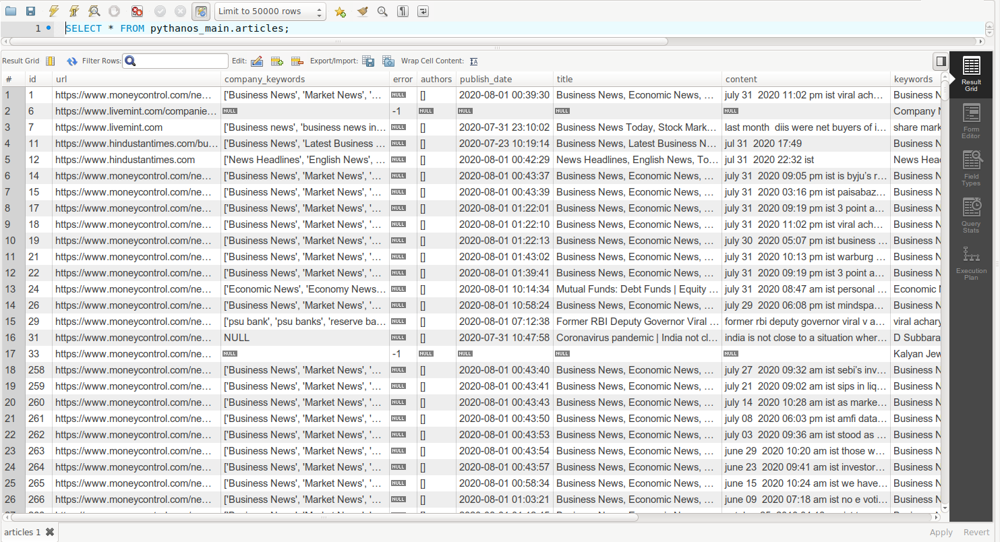
    - Company Table: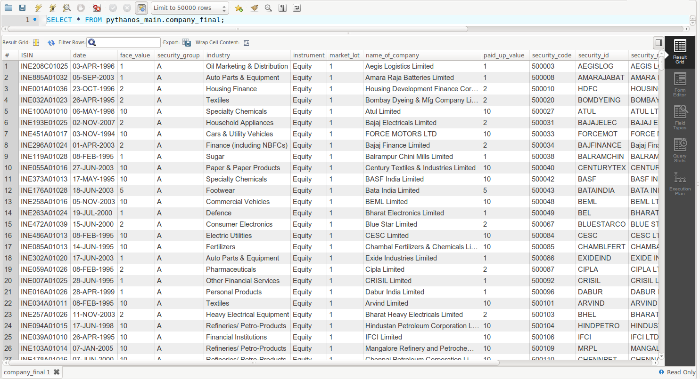
    - Corporate Actions Table: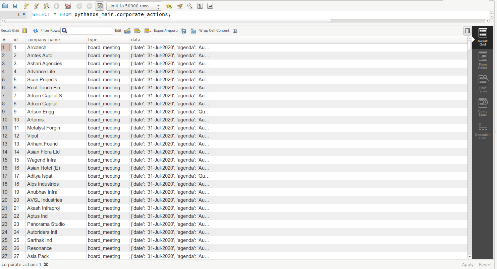
    - Company Data Crawler: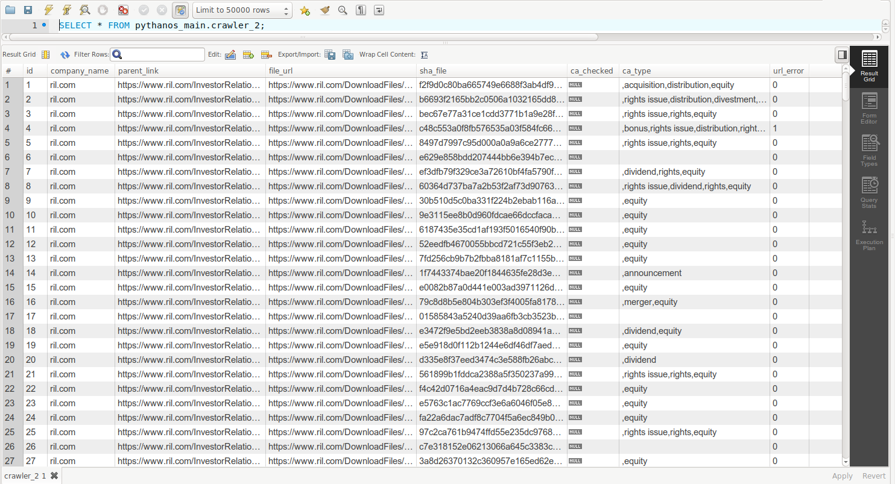
    - Dashboard Securities: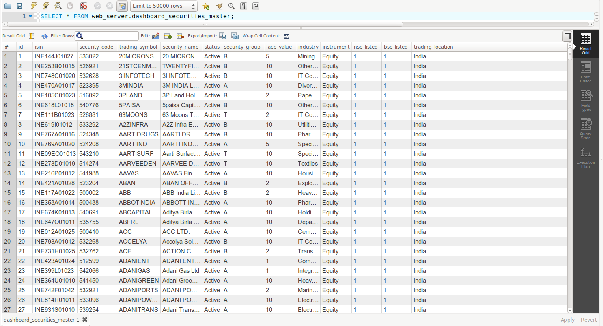

17. **Algorithms Used:**

    - Weighted Average

    - Page Rank 

      

# Current Progress

18. **Data Source for corporate actions (CA)**
    - ***What all is configurable***

      List of securities to be crawled, User Roles, Exception Table, Weighted Ranking system

    - ***Source specific support?***

      News sources such as ____ form the base of the information extraction system

    - ***Intelligent crawling***

      The system incorporates a weighted average algorithm, which ensure the sites are trusted based on how frequently they provide the correct information

    - ***Type of data gathered***

      As shown in few of the tables above, the following data types is extracted from links and pdfs:

      - Free text, Tabular, Images, PDFs

    - ***Types of Documents supported***

      PDF, Images, CSV, HTML

    - ***Schedule structure of data collection:***

      The data is collected in two stages, News Crawler is Real time and Company Data crawler is Scheduled based on inputs from previous stages

    - ***Technology/Tool used***

      - Scrapy, Requests, newspaper3k parser, Selenium
19. **Data Extraction**
    - ***Method of Data Extraction***
    
      Initially, the system starts scraping few trusted set of websites based on historical data
    
      The links obtained are further used to crawl more sites
    
      The HTML pages are parsed to extract the historic data
    
      ***Data points Extraction capability of system***
    
      The system relies on set of feedback that comes from Intelligent Identifier and Self Regulating crawler
    
      The crawler is guided by these feedbacks that are combined using weighted avg algorithm
    
      The News Crawler is capable of scraping 1 link/second, and can extract
    
      The crawler supports various languages(due to Universal Google Encoder) throughout the world to gather information to have a global scope.
    
    - ***Types of documents successfully processed***
    
      PDF, Images, CSV, HTML
    
    - ***Links of data processed and the extent***
    
```
Google News Finance - https://www.google.com/finance
CNBC – https://www.cnbc.com/world/?region=world 
Economic Times – https://economictimes.indiatimes.com/
Business standard – https://www.business-standard.com/
Yahoo Finance – https://in.finance.yahoo.com/
Reuters – https://in.reuters.com/finance
Financial Express – https://www.financialexpress.com/
Capital Markets – http://www.capitalmarket.com/
Live Mint – https://www.livemint.com/latest-news
Market Watch – https://www.marketwatch.com/
Stock News – https://stocknews.com/top-stories/
Bloomberg – https://www.bloomberg.com/global
```


20. Corporate Action scope covered

    - ***CA types supported***

      Dividends(Interim, Final, Quarterly,Special Interim,  Cash), Rights Issue, Bonus Issue,Scrip Dividend,Merger

    - ***Financial market supported***

      Indian and partly global

    - ***Historic/ Current***

      The system is capable of both

    - ***Workflow supported***

      - New announcement of CA

        Yes

      - Modifications

        Yes

      - Cancellations

        No

      - Market talks of CA before announcements

        Yes

      - Do 	system compliment / merge data from various sources to make it 	complete

        Partially

    - ***Quality of Data***

      - How it is determined

      - How conflicting Information on the web is handled

        Data from multiple sources is compared and checked for review(In progress)

      - Technology/Tool/Algorithms used for quality of data

        Name Entity Recognition 

    - ***Usability***

      - Type of application

        Website

      - Actions user can perform with this system

        Admin Panel within all the CA tables

      - Input to system and its corresponding output

      - User overrides/ customisation possibilities

      - Technology/Tool used

    - ***Other Features/ USP***

      - Logic Converter
      - Global Scope
      - Manual Override

    - ***Wow factor of the project***

      - Scalable Architecture
      - Named Entity Recognition in addition to Regex
      - Cost Effective performance
      - Dividend Accuracy
      - User Friendly UI
      - User Roles(Under Progress)
      - RESTful API
      - Effective Data Cleansing

  21. Implementation Details

* Report Generation{GUI of Application}
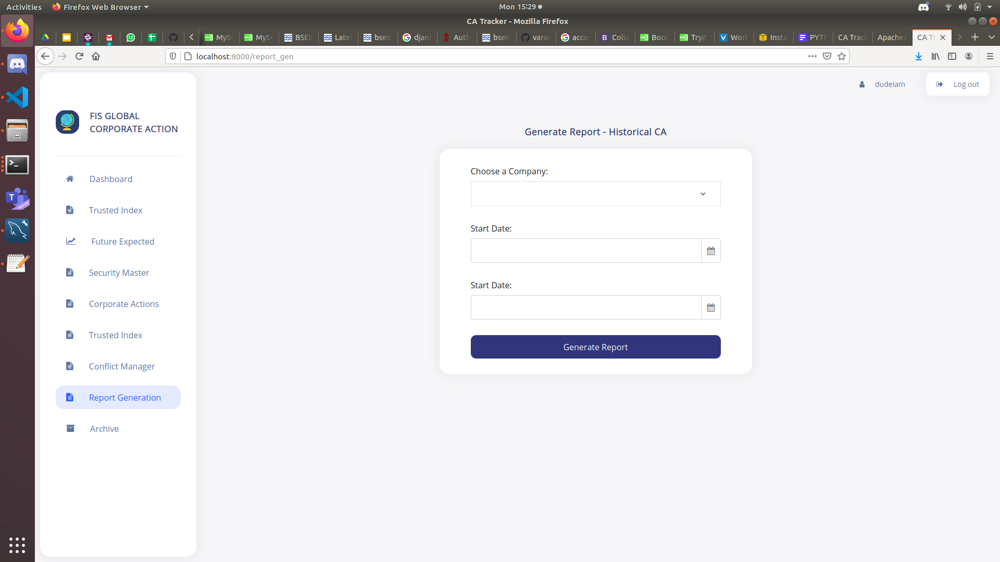  
* CA Page:
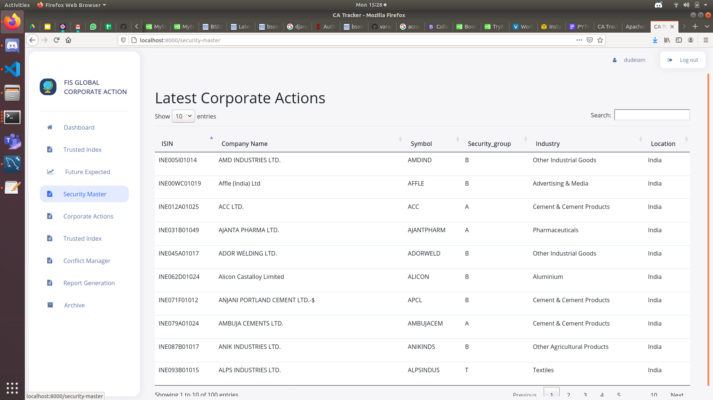  

* REST API:
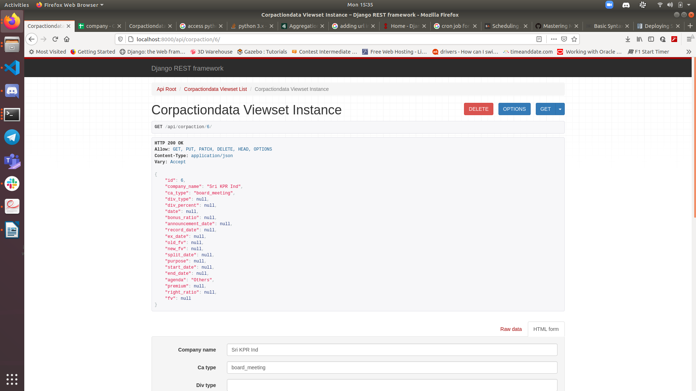  

* Report Generation:

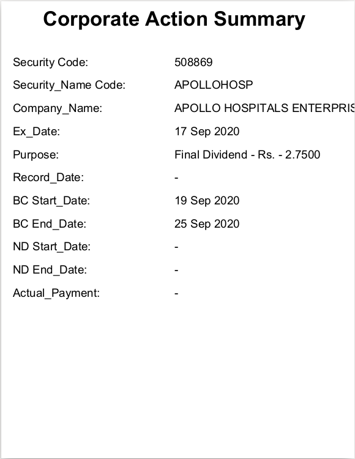  

# Setting up & Running the modules

## Crawler 1

## Crawler 2
* To run the cralwer
open next_gen folder in your terminal and enter the following command:
```
$ scrapy crawl spider1
```
* It will download the files in the download folder inside next_gen folder 

## Document Compare 
In doc_compare folder use this command to validate scrapped news in following to run the code 
```
python3 tensorflow_encoder.py
```
## Information Extractor
* Inputs all downloaded PDFs and sends output to database. In `information_extractor` folder run following command:
```
python3 doc_read_and_extarct.py
```

## Rest API
* SQL based REST API uses bearer token authentication
```
python3 manin.py
```
***NOTE:*** Make changes in database config file, and copy token from `main.py`. 

## Dashboard
Actual website: `sih_website` in dashboard folder 

***NOTE:*** Make changes in database `settings.py` and make migrations and run the code using following command 

```
python3 manage.py makemigrations
python3 manage.py migrate
python3 manage.py runserver
```